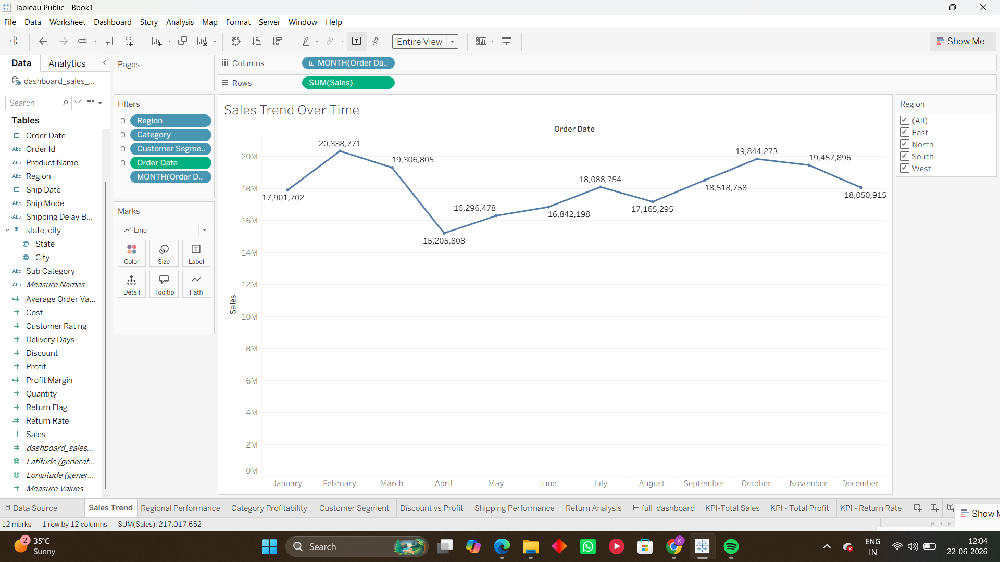
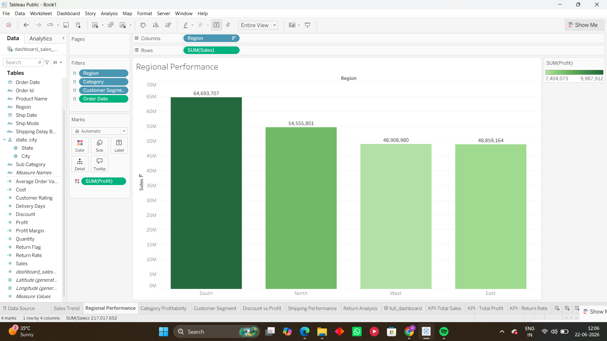
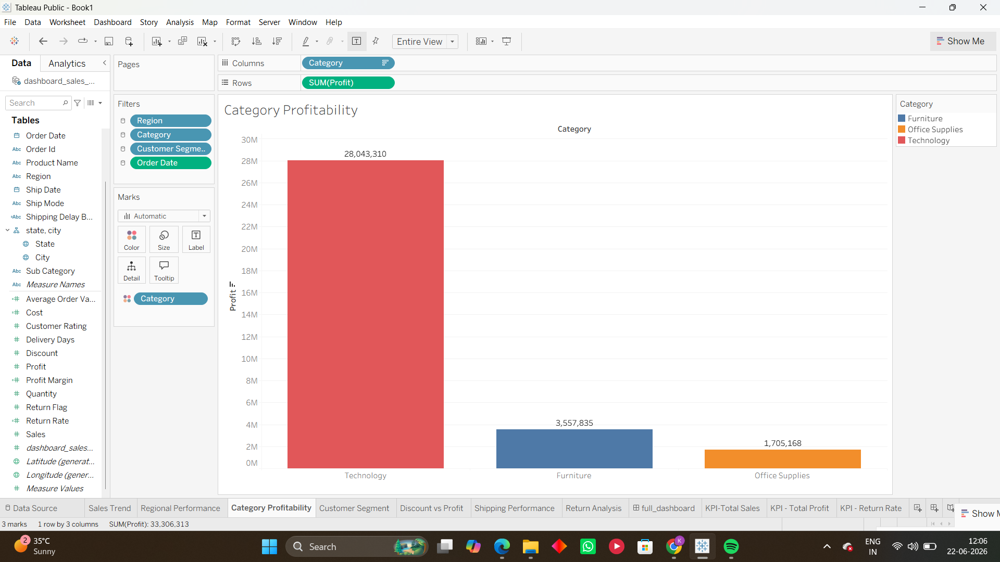
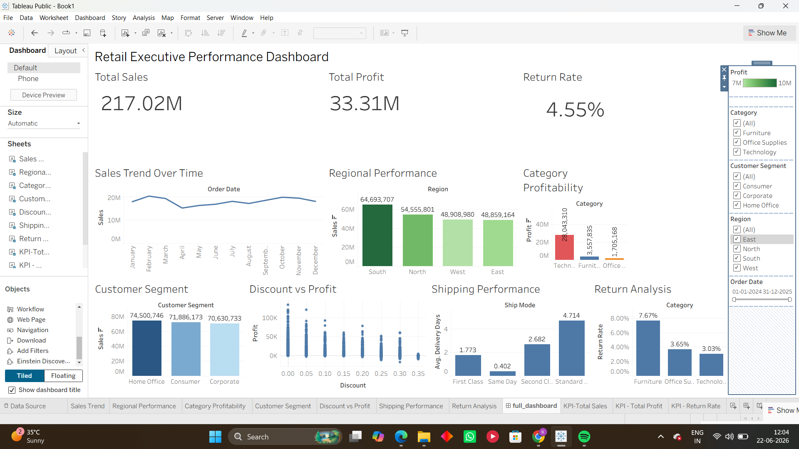
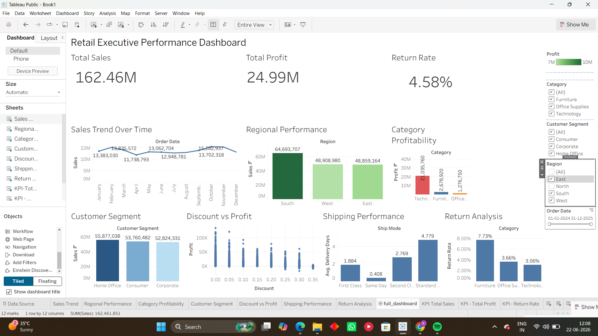

# Retail Executive Performance Dashboard

## Project Overview

This project focuses on building an interactive executive dashboard using Tableau to analyze sales performance, profitability, customer behavior, shipping efficiency, and return trends.

The dashboard enables business users and decision-makers to explore key performance metrics through interactive visualizations and filters. It provides insights into regional performance, product category profitability, customer segment behavior, discount impact, shipping performance, and product returns.

---

# Project Objectives

The primary objectives of this project are:

* Analyze overall sales and profitability performance.
* Identify high-performing and low-performing regions.
* Evaluate profitability across product categories.
* Understand customer segment contribution to revenue.
* Examine the impact of discounts on profitability.
* Monitor shipping efficiency.
* Analyze product return patterns.
* Provide an interactive executive dashboard for business decision-making.

---

# Dataset Description

The dataset contains retail sales transaction data with information related to:

* Orders
* Customers
* Regions
* Product Categories
* Sales
* Profit
* Discounts
* Shipping
* Returns

### Key Variables

| Variable         | Description               |
| ---------------- | ------------------------- |
| Order ID         | Unique order identifier   |
| Order Date       | Date of order placement   |
| Ship Date        | Date of shipment          |
| Region           | Geographic region         |
| Customer Segment | Customer classification   |
| Category         | Product category          |
| Sales            | Sales amount              |
| Profit           | Profit amount             |
| Discount         | Discount percentage       |
| Return Flag      | Indicates returned orders |
| Delivery Days    | Shipping duration         |
| Ship Mode        | Shipping method           |

---

# Calculated Fields Created

The following calculated fields were created in Tableau:

## Profit Margin

```tableau
SUM([Profit]) / SUM([Sales])
```

Purpose:
Measures profitability relative to sales revenue.

---

## Cost

```tableau
SUM([Sales]) - SUM([Profit])
```

Purpose:
Estimates product cost contribution.

---

## Average Order Value

```tableau
SUM([Sales]) / COUNTD([Order Id])
```

Purpose:
Measures average revenue generated per order.

---

## Return Rate

```tableau
SUM([Return Flag]) / COUNT([Order Id])
```

Purpose:
Measures the percentage of returned orders.

---

## Shipping Delay Bucket

```tableau
IF [Delivery Days] <= 2 THEN "Fast"
ELSEIF [Delivery Days] <= 5 THEN "Normal"
ELSE "Delayed"
END
```

Purpose:
Classifies delivery performance.

---

# Dashboard Components

## KPI Cards

The dashboard includes three KPI cards:

### Total Sales

Displays overall sales generated across all orders.

### Total Profit

Displays total profit generated.

### Return Rate

Displays the percentage of returned orders.

---

## Sales Trend Analysis

### Chart Type

Line Chart

### Purpose

Tracks monthly sales performance over time and identifies sales trends and seasonal patterns.

### Screenshot



```

---

## Regional Performance Analysis

### Chart Type

Bar Chart

### Purpose

Compares sales performance across regions and highlights regional differences.

### Screenshot


```

---

## Category Profitability Analysis

### Chart Type

Bar Chart

### Purpose

Compares profitability across product categories and identifies the most profitable categories.

### Screenshot



```

---

## Customer Segment Analysis

### Chart Type

Bar Chart

### Purpose

Evaluates revenue contribution across customer segments.

---

## Discount vs Profit Analysis

### Chart Type

Scatter Plot

### Purpose

Examines the relationship between discounts and profitability.

---

## Shipping Performance Analysis

### Chart Type

Bar Chart

### Purpose

Compares average delivery times across shipping modes.

---

## Return Analysis

### Chart Type

Bar Chart

### Purpose

Compares return rates across product categories.

---

# Interactive Features

The dashboard includes multiple interactive features.

## Filters

Users can dynamically filter dashboard results using:

* Region
* Category
* Customer Segment
* Order Date

---

## Dashboard Actions

A filter action was implemented to allow users to click a region and automatically update all related visualizations.

This feature improves dashboard usability and enables deeper analysis.

---

# Dashboard Screenshot


```

---

# Filter Interaction Example

The dashboard supports dynamic filtering.

Example:
Selecting a region such as North updates:

* KPI Cards
* Sales Trend
* Category Profitability
* Customer Segment Analysis
* Return Analysis
* Shipping Performance

### Screenshot



```

---

# Key Findings

### Regional Performance

The South region generated the highest overall sales performance.

### Product Profitability

Technology products generated the highest profits among all categories.

### Customer Segments

Home Office customers contributed significantly to overall sales.

### Returns

Furniture products exhibited the highest return rate.

### Shipping

Standard Class shipping demonstrated longer delivery durations compared to premium shipping methods.

### Discounts

Higher discounts were associated with lower profitability.

---

# Repository Structure

```text
krishnavbajaj_2511152_part4_tableau_dashboard/

│
├── README.md
│
├── data/
│   └── dashboard_sales_data.xlsx
│
├── tableau/
│   └── executive_dashboard.twbx
│
├── outputs/
│   ├── business_insights.md
│   ├── dashboard_story.md
│   └── chart_selection_justification.md
│
└── screenshots/
    ├── full_dashboard.png
    ├── sales_trend_view.png
    ├── regional_performance_view.png
    ├── category_profitability_view.png
    └── filter_interaction_view.png
```

---

# Tools Used

* Tableau Desktop
* Microsoft Excel
* GitHub

---

# Conclusion

The Retail Executive Performance Dashboard provides a comprehensive view of sales, profitability, customer behavior, shipping efficiency, and return performance. Through interactive visualizations and filtering capabilities, the dashboard enables business stakeholders to make informed decisions and identify opportunities for growth and operational improvement.
